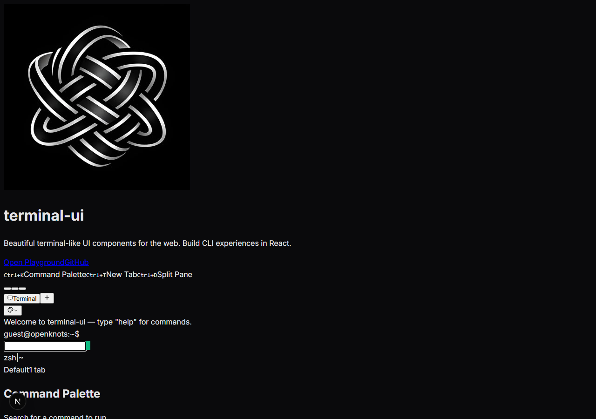
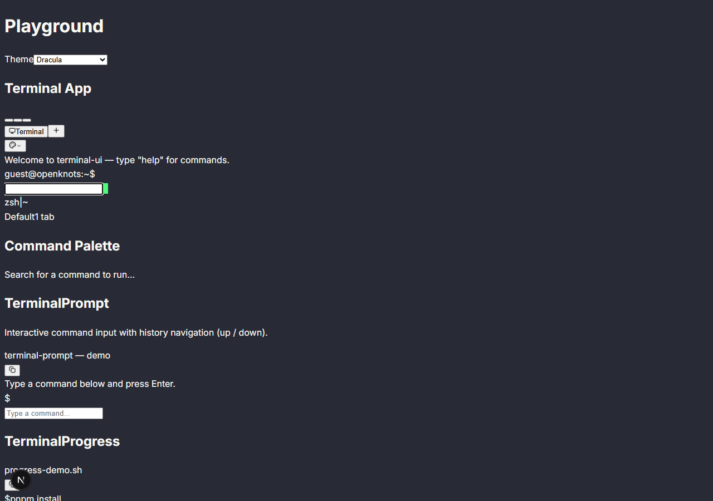
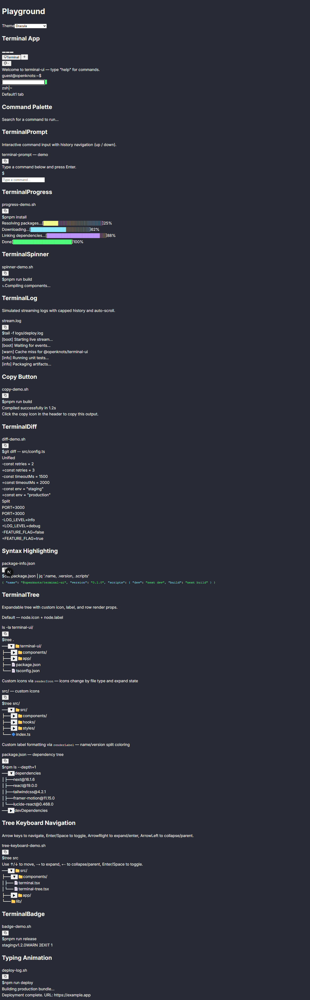

# 🖥️ terminal-ui

> Beautiful terminal-like UI components for the web. Build CLI experiences in React.

[](https://github.com/OpenKnots/terminal-ui/actions/workflows/ci.yml)
[](LICENSE)
[](CONTRIBUTING.md)
[](AGENTS.md)

> 🤖 **AI Agent Friendly!** This repo has comprehensive guides for AI agents (OpenClaw, etc.) to contribute automatically. See [AGENTS.md](AGENTS.md) and [PROJECT_CONTEXT.md](PROJECT_CONTEXT.md).



## 🎯 What is this?

A collection of React components that bring the elegance of terminal UIs to the browser. Perfect for:

- 🤖 AI agent interfaces (like OpenClaw)
- 📚 Interactive CLI tutorials
- 🎮 Developer tools and dashboards
- 🎨 Retro-futuristic web apps

## ✨ Features

- 🎨 **Beautiful out of the box** - Glassmorphic design with smooth animations
- ⚡ **Lightweight** - No heavy dependencies
- 🎹 **Keyboard-first** - Full keyboard navigation support
- 🌈 **Syntax highlighting** - Built-in code formatting
- 📱 **Responsive** - Works on desktop and mobile
- 🎭 **Customizable** - Theming system with CSS variables

## 🚀 Quick Start

```bash
pnpm add @openknots/terminal-ui
```

```tsx
import { Terminal, TerminalCommand } from '@openknots/terminal-ui'

export default function App() {
  return (
    <Terminal prompt="user@demo">
      <TerminalCommand>npm install terminal-ui</TerminalCommand>
      <TerminalOutput>✓ Installed terminal-ui@0.1.0</TerminalOutput>
    </Terminal>
  )
}
```

## 📦 Components



### Available Now

- **Terminal** - Main container with window chrome
- **TerminalCommand** - Render a command with prompt
- **TerminalOutput** - Format command output
- **TerminalSpinner** - Loading indicators

### Coming Soon (Good First Issues!)

- **TerminalProgress** - Progress bars → [Issue #2](../../issues/2)
- **TerminalTable** - Render tables → [Issue #4](../../issues/4)
- **TerminalTree** - File tree views → [Issue #9](../../issues/9)
- **TerminalPrompt** - Interactive input → [Issue #12](../../issues/12)

## 📊 Component Status Matrix

| Component | Status | Keyboard Support | Notes |
|---|---|---|---|
| `Terminal` | ✅ Stable | ✅ | Core window chrome + content container |
| `TerminalCommand` | ✅ Stable | ✅ | Prompt + command line rendering |
| `TerminalOutput` | ✅ Stable | ✅ | Semantic output colors + optional animation |
| `TerminalSpinner` | ✅ Stable | ✅ | Braille frame animation for loading states |
| `TerminalTree` | ✅ Stable | ✅ | Expandable tree with render-props + keyboard nav |
| `TerminalBadge` | ✅ Stable | — | Inline status badges with variant colors |
| `TerminalDiff` | ✅ Stable | ✅ | Unified and split diff views |
| `TerminalLog` | 🧪 Beta | ✅ | Streaming log viewer with capped history |
| `TerminalTable` | 🧪 Beta | ✅ | Terminal-style tabular data |
| `TerminalPrompt` | 🧪 Beta | ✅ | Interactive prompt patterns |
| `TerminalProgress` | 🧪 Beta | ✅ | Progress indicators |
| `TerminalAutocomplete` | 🧪 Beta | ✅ | Command autocomplete with fuzzy matching |

<details>
<summary>📸 Full component gallery</summary>



</details>
| `ThemeSwitcher` | ✅ Stable | ✅ | Runtime theme dropdown with localStorage |
| `GhosttyThemePicker` | 🧪 Beta | ✅ | Ghostty theme parser + picker grid |

> Legend: ✅ Stable = production-ready baseline, 🧪 Beta = usable with active iteration.

## 🎮 Live Demo

[**→ View the Playground**](https://terminal-ui.vercel.app)

## 🤖 For AI Agents (OpenClaw, etc.)

This repository is **designed for AI agent contributions**. Complete documentation provided:

### Quick Start

**Simplest approach:**

```
@agent Read https://github.com/OpenKnots/terminal-ui/blob/main/AGENTS.md
and implement a good-first-issue
```

**What AGENTS.md contains:**
- ✅ Complete project structure
- ✅ Step-by-step theme guide (just copy-paste CSS)
- ✅ Component templates with examples
- ✅ Development workflow (setup → test → PR)
- ✅ Styling rules and patterns
- ✅ PR checklist and examples
- ✅ Common pitfalls to avoid

### Example Task

```bash
# Task: Add Dracula color theme (5 minutes)

1. Read AGENTS.md section "Adding a Color Theme"
2. Get official colors from draculatheme.com
3. Add theme block to app/globals.css
4. Run `pnpm run build` to verify
5. Take screenshot
6. Open PR with title "feat: add Dracula color theme"
7. Include screenshot and checklist
```

### Key Resources

- **[AGENTS.md](AGENTS.md)** — Complete agent guide (13KB, read this first!)
- **[PROJECT_CONTEXT.md](PROJECT_CONTEXT.md)** — Project status and decisions
- **[OPENCLAW_USAGE.md](OPENCLAW_USAGE.md)** — OpenClaw-specific instructions
- **[.github/STARTER_ISSUES.md](.github/STARTER_ISSUES.md)** — 12 pre-written issues to implement

### What Agents Can Do

| Task | Time | Difficulty | Guide Section |
|------|------|------------|---------------|
| Add color theme | 5 min | ⭐ Easy | "Adding a Color Theme" |
| Create TerminalProgress | 15 min | ⭐⭐ Medium | "Creating a Component" |
| Add JSDoc comments | 10 min | ⭐ Easy | "Component Guidelines" |
| Fix mobile scrolling | 20 min | ⭐⭐ Medium | Follow issue #7 |

All tasks include:
- Step-by-step instructions in the issue
- Code templates in AGENTS.md
- Clear acceptance criteria
- Example PRs to reference

### Success Rate

Agents that follow AGENTS.md consistently produce **production-ready PRs** that can be merged immediately. The guide includes:

- ✅ TypeScript patterns
- ✅ Component templates
- ✅ Styling rules (CSS variables + Tailwind)
- ✅ Testing workflow
- ✅ PR checklist
- ✅ Common mistakes to avoid

**Result:** High-quality automated contributions! 🎉

## 🤝 Contributing

We **love** contributions! This repo is designed for practice PRs.

**Good first issues:**
- 🎨 Add a new color theme
- 📦 Create a new component
- 📚 Improve documentation
- 🐛 Fix a bug
- ✨ Add an example

**For Humans:**
- 📖 [CONTRIBUTING.md](CONTRIBUTING.md) - Contribution guidelines
- 💡 [GOOD_FIRST_ISSUES.md](GOOD_FIRST_ISSUES.md) - Ideas for PRs
- 🛡️ [.github/BRANCH_PROTECTION.md](.github/BRANCH_PROTECTION.md) - Recommended merge safeguards

**For AI Agents:**
- 🤖 [AGENTS.md](AGENTS.md) - Complete agent guide (start here!)
- 🎯 [PROJECT_CONTEXT.md](PROJECT_CONTEXT.md) - Project overview & status
- 🚀 [OPENCLAW_USAGE.md](OPENCLAW_USAGE.md) - How to use with OpenClaw

**Quick Start for Agents:**

```
1. Read AGENTS.md (complete patterns & templates)
2. Browse good-first-issues: https://github.com/OpenKnots/terminal-ui/issues?q=label%3A%22good-first-issue%22
3. Pick an issue, follow AGENTS.md guide
4. Open PR with checklist completed
```

## 🎯 Project Goals

1. **Make CLI UIs accessible** - Bring terminal aesthetics to the web
2. **Practice PR workflow** - Perfect for testing tools like [code-flow](https://github.com/OpenKnots/code-flow)
3. **Build community** - Create a library together

## 📜 License

MIT © OpenKnots

---

Built with ❤️ by the OpenClaw community
